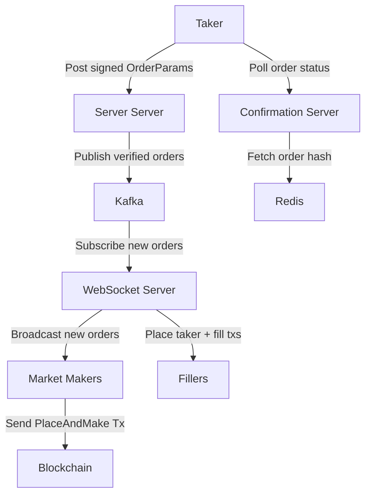

# Swift Server

Infrastructure for the Swift order pipeline.

### Architecture

There are 3 server components:

- **Swift Server**: HTTP server for receiving signed order messages from takers e.g. via the UI
- **Ws Server**: Ws server for broadcasting taker orders to market makers
- **Confirmation Server**: Provides API for server progress tracking



## Dependency setup

ensure an x86_64 toolchain is configured for building `swift-server`

```shell
rustup install 1.87.0-x86_64-apple-darwin
# run inside swift-server directory
rustup override set 1.87.0-x86_64-apple-darwin
```

if on a newer ARM mac, need to install x86 libraries to run tests and build locally
```shell
# install x86-64 brew
arch -x86_64 /bin/bash -c "$(curl -fsSL https://raw.githubusercontent.com/Homebrew/install/HEAD/install.sh)"

# install x86 deps
arch -x86_64 /usr/local/bin/brew install librdkafka cyrus-sasl pkg-config zstd lz4 openssl@3
```

run tests:
```shell
# Ensure Intel Homebrew is used first
export PATH="/usr/local/bin:/usr/local/sbin:$PATH"

# Make sure no ARM include/lib paths are leaking in
unset CPATH CFLAGS CXXFLAGS CPPFLAGS SDKROOT LIBRARY_PATH DYLD_LIBRARY_PATH

# Run tests under Rosetta with dynamic linking to Intel librdkafka
arch -x86_64 env \
  RUSTUP_TOOLCHAIN=1.87.0-x86_64-apple-darwin \
  RDKAFKA_BUILD=0 \
  RDKAFKA_STATIC=0 \
  PKG_CONFIG_PATH="/usr/local/lib/pkgconfig:/usr/local/opt/openssl@3/lib/pkgconfig" \
  DYLD_FALLBACK_LIBRARY_PATH="/usr/local/lib:/usr/local/opt/librdkafka/lib:/usr/local/opt/cyrus-sasl/lib" \
  cargo test 

# Run a specific test
arch -x86_64 env \
  RUSTUP_TOOLCHAIN=1.87.0-x86_64-apple-darwin \
  RDKAFKA_BUILD=0 \
  RDKAFKA_STATIC=0 \
  PKG_CONFIG_PATH="/usr/local/lib/pkgconfig:/usr/local/opt/openssl@3/lib/pkgconfig" \
  DYLD_FALLBACK_LIBRARY_PATH="/usr/local/lib:/usr/local/opt/librdkafka/lib:/usr/local/opt/cyrus-sasl/lib" \
  cargo test \
  types::messages::tests -- --nocapture
```


## Build

```shell
cargo build --release
```

Run it

```shell
./target/release/swift-server --help
```

## Run

The server stack uses kafka for sending messages between the `swift_server` and the `ws_server`.  
`docker-compose up` to run a local kafka instance.
