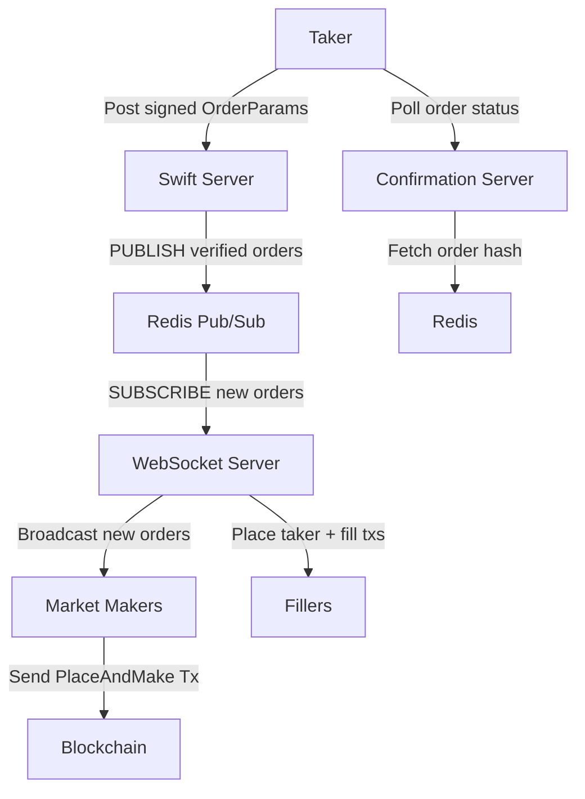

# Swift Server

Infrastructure for the Swift order pipeline.

### Architecture

There are 3 server components:

- **Swift Server**: HTTP server for receiving signed order messages from takers e.g. via the UI
- **Ws Server**: Ws server for broadcasting taker orders to market makers
- **Confirmation Server**: Provides API for server progress tracking


```mermaid
graph TD
    A[Taker]
    B[Swift Server]
    C[WebSocket Server]
    D[Market Makers]
    E[Redis Pub/Sub]
    F[Blockchain]
    G[Confirmation Server]
    H[Redis]
    I[Fillers]
    A -->|Post signed OrderParams| B
    B -->|PUBLISH verified orders | E
    C -->|Broadcast new orders| D
    D -->|Send PlaceAndMake Tx| F
    E --> |SUBSCRIBE new orders| C
    A -->|Poll order status|G
    G -->|Fetch order hash|H
    C -->|Place taker + fill txs| I
```

## Build

```shell
cargo build --release
```

Run it

```shell
./target/release/swift-server --help
```

## Run

The server stack uses Redis pub/sub for sending messages between the `swift_server` and the `ws_server`.
`docker-compose up` to run a local Redis instance plus both servers.

### Environment

- `ELASTICACHE_HOST` / `ELASTICACHE_PORT` — Redis host/port (default `localhost:6379`)
- `USE_SSL` — set to `true` to use `rediss://` (TLS)
