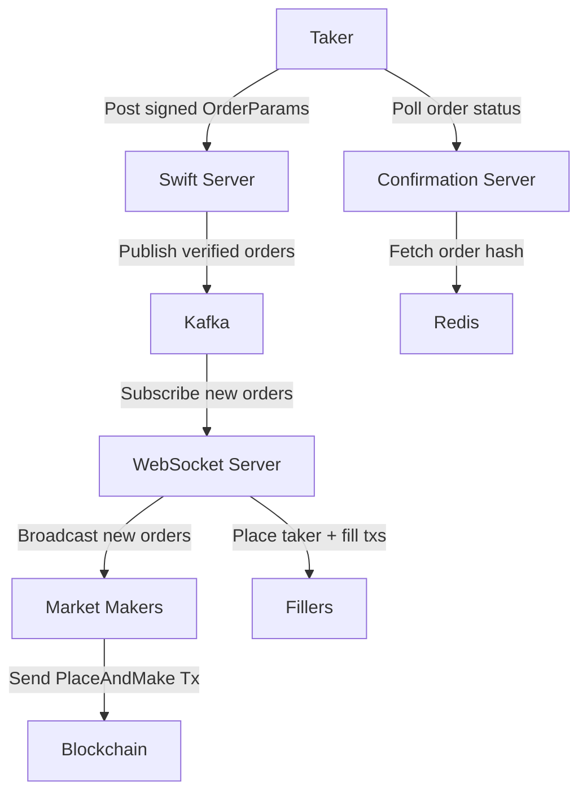

# Swift Server
Infrastructure for the Swift order pipeline (formerly Fastlane).

### Architecture
There are 3 server components:
- **Swift Server**: HTTP server for receiving signed order messages from takers e.g. via the UI
- **Ws Server**: Ws server for broadcasting taker orders to market makers
- **Confirmation Server**: Provides API for Swift progress tracking



## Build
ensure an x86_64 toolchain is configured for building `swift-server`
```shell
rustup install 1.83.0-x86_64-apple-darwin
# run inside swift-server directory
rusutp override set 1.83.0-x86_64-apple-darwin
```

```shell
cargo build --release
```

Run it
```shell
./target/release/swift-server --help
```

## Run
The swift stack uses kafka for sending messages between the `swift_server` and the `ws_server`.  
`docker-compose up` to run a local kafka instance.  
